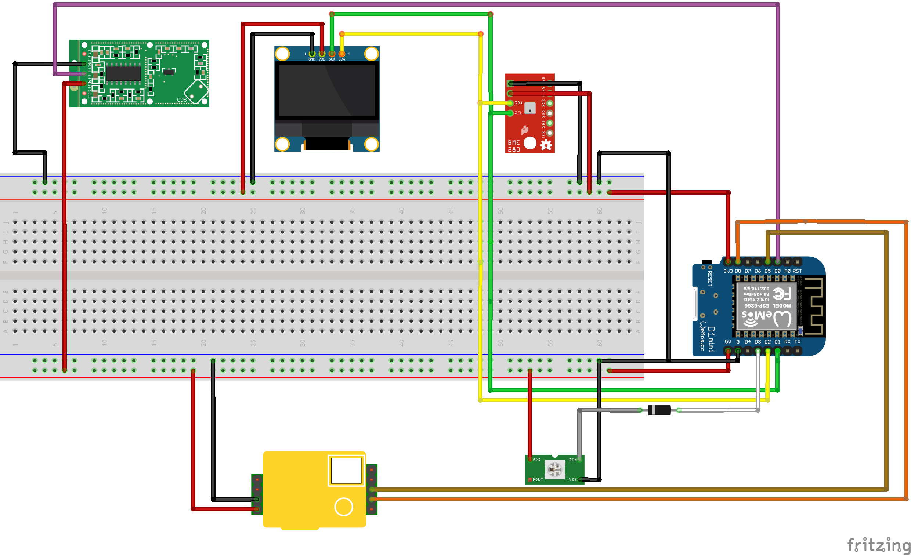

# The Kiwi Monitor hardware

## Bill of materials

We link to a Dutch store for easy buying, but no need to buy it there.

- [Wemos/LOLIN D1 Mini V3(ESP8266)](https://www.tinytronics.nl/shop/nl/communicatie/wi-fi/wemos-d1-mini-v2-esp8266-12f-ch340) 
- [Winsen MH-Z19B CO2 Sensor](https://www.tinytronics.nl/shop/nl/sensoren/temperatuur-lucht-vochtigheid/winsen-mh-z19b-co2-sensor-met-kabel): be sure to get the __B version__.
- [BME280 I2C Temperature/Humidity Sensor](https://www.tinytronics.nl/shop/nl/sensoren/temperatuur-lucht-vochtigheid/bme280-digitale-barometer-druk-en-vochtigheid-sensor-module): make sure you get a version that has I2C enabled by default, or be prepared to switch it from SPI to I2C. BMP280 is also fine.
- [RCWL-0516 movement sensor](https://www.tinytronics.nl/shop/en/communication/rf/microwave-movement-sensor-rcwl-0516) a small sensor to detect movement up to 7m away from the sensor, used for screen off sensor, and useful for building monitoring.
- [SSD1306 128x32 OLED screen I2C](https://www.tinytronics.nl/shop/nl/display/oled/0.91-inch-oled-display-128*32-pixels-wit-i2c): Make sure to get the I2C version, brand name doesn't matter too much, as long as it has a SSD1306 chipset.
- [WS2812B RGB Led](https://www.tinytronics.nl/shop/nl/verlichting/led-digitaal/ws2812b-digitale-5050-rgb-led-printplaat-los-wit): You need a single one, but for fun you can also buy a whole strip and have some other projects with them.

Optional:

- [Nova SDS011](https://www.tinytronics.nl/shop/nl/sensoren/temperatuur-lucht-vochtigheid/nova-sds011-hoge-precisie-laser-stofsensor): if you want to measure PM2.5 & PM10 fine dust particles
- [DS18B20 temperature sensor](https://www.tinytronics.nl/shop/nl/sensoren/temperatuur-lucht-vochtigheid/ds18b20-to-92-thermometer-temperatuur-sensor): if you want to measure temperature more accurately

Stuff we assume you already have:

- USB charger (500ma should be enough)
- Micro-USB cable
- Wires to connect sensors to the ESP8266
- Breadboard & jumper wires for experimentation
- Soldering iron

## Schema

In Summary, labels on the Wemos D1 Mini

| Component | Component side | Wemos D1 Mini |
| --- | --- | --- |
| MH-Z19B | VCC | 5V |
| | GND | G (GND) |
| | TX | D5 |
| | RX | D8 |
| BME280 & SSD1306 | VCC | 3.3V |
| | GND | G |
| | SCL/SCK | D1 |
| | SDA | D2 |
|WS2812B | VDD | 5V |
| | VSS | G |
| | DIN | D4|
| RCWL-0516 | VCC/VIN | 5V |
| | VOUT | D0 |
| | GND | G |
|SDS011 (opt) | VCC | 5V |
| | GND | G |
| | TX | D3 |
| | RX | D6 |
|DS18B20 (opt) | GND (left) | G |
| | DQ (middle) | D7 |
| | VDD (right) | 5V |

## Breadboard view

