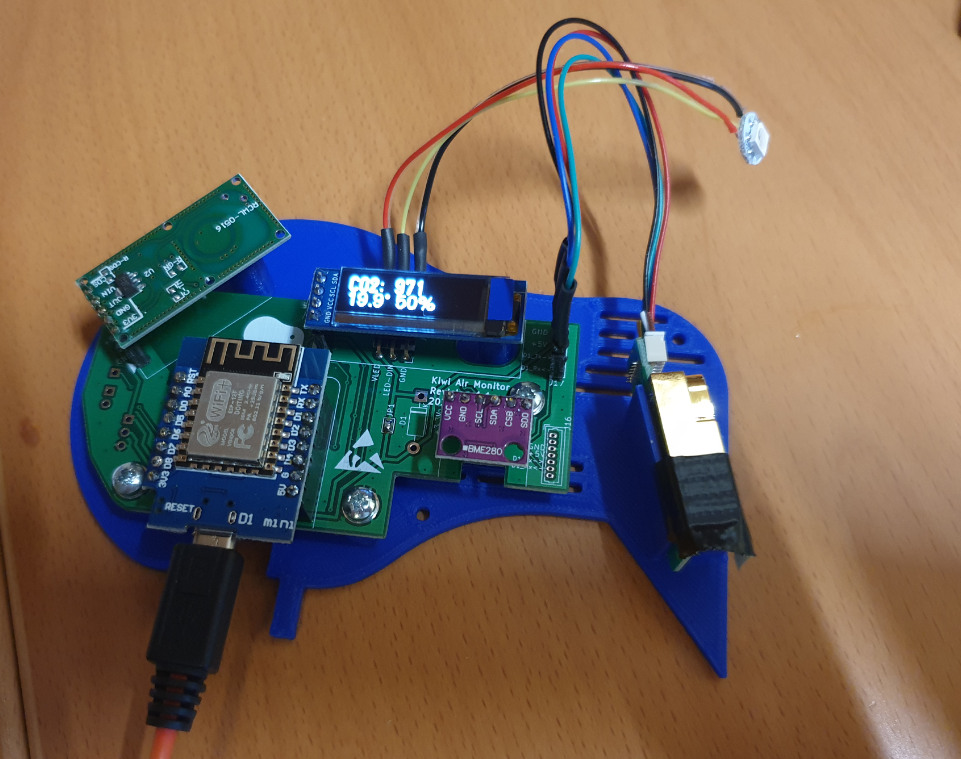
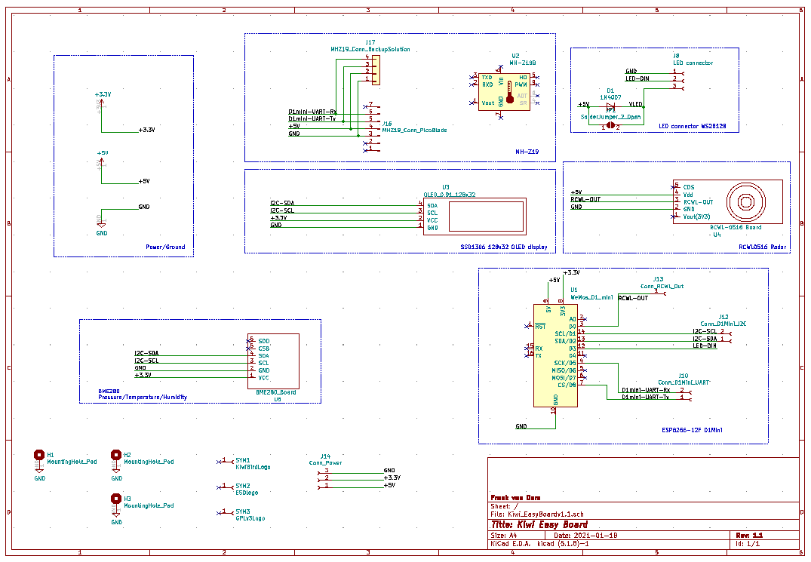
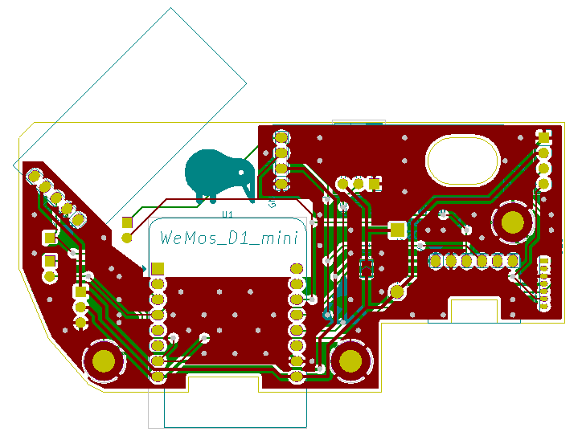
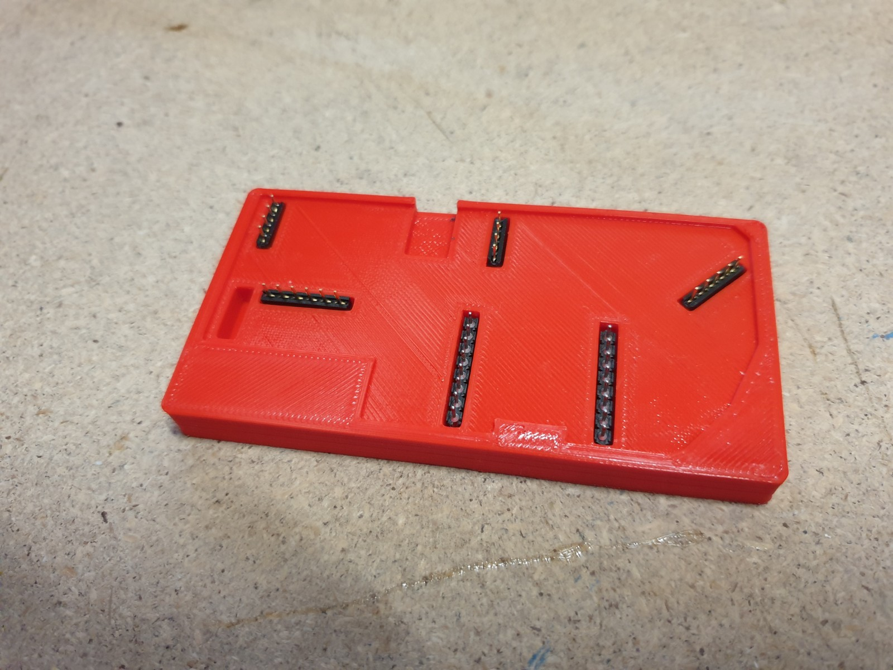
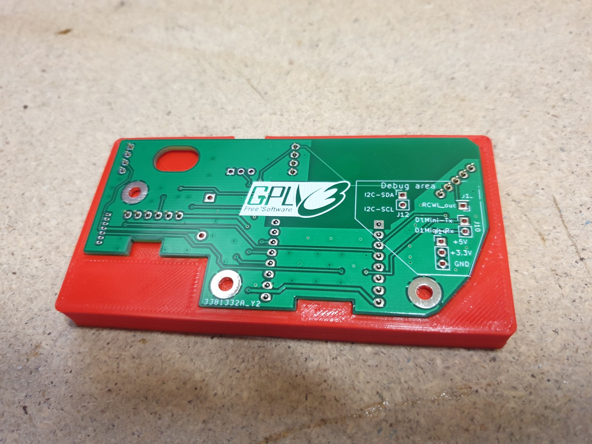
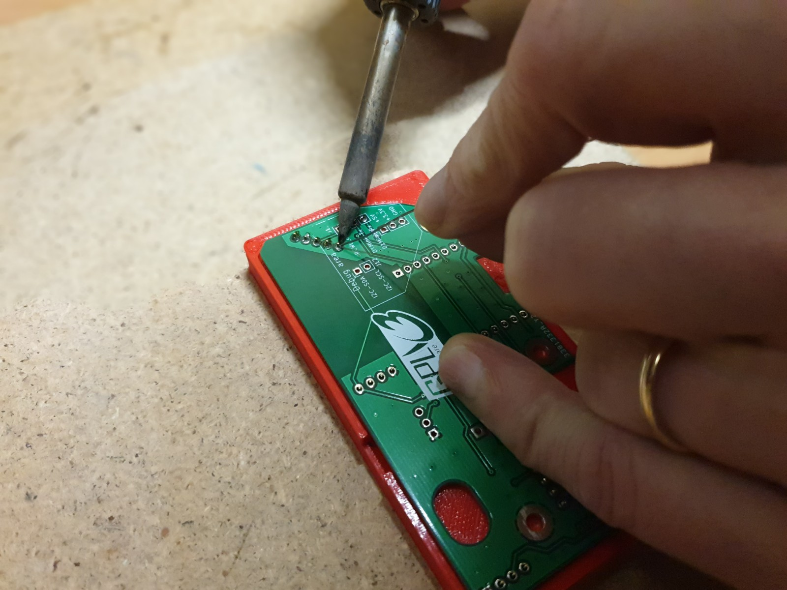
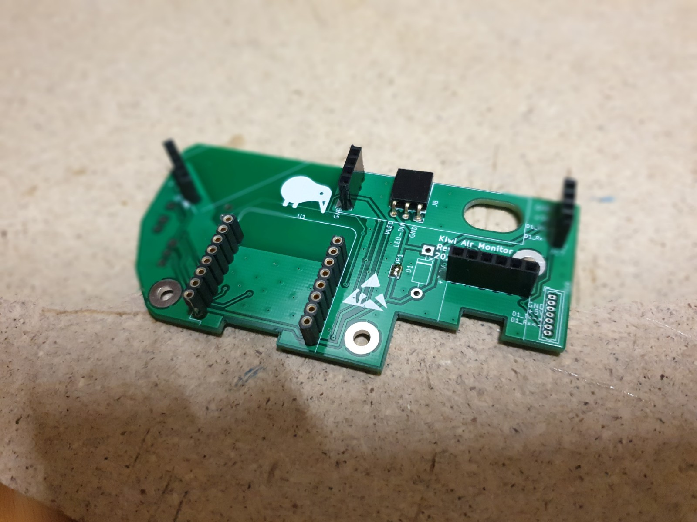

# Hardware

Om alle componenten op een makkelijke en zekere manier met elkaar te verbinden hebben we een PCB ontworpen zoals hieronder te zien. We zijn nog bezig een manier te vinden dit PCB voor anderen beschikbaar te maken.

## Bestellijst 

De hardware is ontworpen rondom een ESP8266 platform. De kosten voor alle componentne zijn ongeveer 45-50 euro per apparaat. Hieronder links naar de verschillende componenten (hoeft niet perse daar gekocht te worden). 

- [Wemos D1 Mini - ESP8266-12F](https://www.tinytronics.nl/shop/en/communication/wi-fi/d1-mini-esp8266-12f-ch340) Zorg ervoor dat je de versie koopt met de "deksel" deze is FCC gekeurd en geeft minder storing op de bewegingssensor.
- [Winsen MH-Z19C CO2 Sensor](https://www.tinytronics.nl/shop/nl/sensoren/temperatuur-lucht-vochtigheid/winsen-mh-z19c-co2-sensor-met-kabel): We gebruiken nu de **versie C**. Deze is stabieler dan de versie B en volgens de specificaties ook nauwkeuriger. Deze versie word op het PCB aangesloten met het bijgeleverde kabeltje via een 7-pins PicoBlade connector. Vanwege hoge temperaturen word solderen direct op de sensor afgeraden. De MH-Z19 is een NDIR-type CO2 sensor, die na calibratie een goede sensitiviteit heeft. De nauwkeurigheid is echter niet vergelijkbaaar met een industriele sensor (4 a 5 keer zo duur). De echte CO2 waarde kan ongeveer 50 ppm hoger of lager zijn, maar de trend en de grove waardes zijn voor dit doeleinde meer dan genoeg.
- [BME280 I2C Temperature/Humidity Sensor](https://www.tinytronics.nl/shop/nl/sensoren/temperatuur-lucht-vochtigheid/bme280-digitale-barometer-druk-en-vochtigheid-sensor-module): zorg ervoor dat je een versie aanschaft die geconfigureerd is voor I2C, of zorg ervoor dat je het om kunt zetten van SPI naar I2C. BMP280 is ook prima. [Tests](http://www.kandrsmith.org/RJS/Misc/Hygrometers/calib_many.html) hebben laten zien dat de metingen accuraat en stabiel zijn. Afhankelijk hoe de sensor geconfigureerd wordt, zal de temperatuur een beetje onder of boven de echte waar zijn. Soldeer de header connector zo, dat de sensor aan de onderkant zit.
- [RCWL-0516 movement sensor](https://www.tinytronics.nl/shop/en/communication/rf/microwave-movement-sensor-rcwl-0516) een kleine sensor die beweging tot 7 m kan detecteren. In dit project wordt deze vooral gebruikt om te detecteren of er mensen aanwezig zijn en of het dus nodig is om iets op het display van de kiwi air monitor te laten zien (of dat het scherm uit kan). Soldeer de header connector zo, dat de componenten aan de onderkant zitten en de labels aan de bovenkant. 
- [SSD1306 128x32 OLED screen I2C](https://www.tinytronics.nl/shop/nl/display/oled/0.91-inch-oled-display-128*32-pixels-wit-i2c): zorg ervoor dat het een I2C versie is en een SSD1306 chipset heeft. Merk maakt niet veel uit. 
- [WS2812B RGB Led](https://www.tinytronics.nl/shop/nl/verlichting/led-digitaal/ws2812b-digitale-5050-rgb-led-printplaat-los-wit): Per apparaat is maar een ledje nodig, maar je kunt ook een hele strip kopen en er andere leuke dingen mee doen. De LED gestuurd word vanuit de D1Mini met spanning tussen 0V-3.3V. Volgens de WS2812B specificatie ligt het logisch '1' schakelniveau van deze chip op 0.7*VDD. Bij een Voedingsspanning van 5.0V zou de chip dus 3.5V op zijn data-in moeten hebben. Om dit probleem te omzeilen hebben we een diode in het voedingspad naar de LED gezet zodat we een spanning krijgen van 5.0V-0.7V=4.3V. Het logisch '1' schakel niveau komt hierdoor te liggen op 0.7 * 4.3 = 3.01V. Parallel aan de diode zit een soldeer brug.
- [7 pins Molex PicoBlade connector](https://sinuss.nl/zoeken?keyword=53047-0710): Connector om de MH-Z19C met het PCB te verbinden
- Kiwi Easyboard PCB: We hebben een PCB ontworpen waardoor de componenten makkelijk met elkaar verbonden kunnen worden.  De design files in KiCad en de gerbers zijn [hier beschikbaar](../../device/design/). De huidige versie is v1.1

Onderdelen die ook nodig zijn, maar waarvan we aannemen dat je die al hebt:
- USB oplader (500ma zou genoeg moeten zijn) of alternatief een powerbank, per dag ongeveer 800mAh rekenen.
- Micro-USB kabel
- Kabeltjes om de LED met de PCB te verbinden
- Een stel headers: Female voor op het PCB. Male voor aan de sensorren. (Sommige sensoren worden geleverd met pin headers).
- Soldeerbout
- Voor exprimenteren: Breadboard en kabeltjes om te experimenteren
  
## Stroomverbruik

De Kiwi verbruikt per uur ongeveer 30mAh. Meeste simple USB voedingen voldoen (500mA is ruim voldoende). Daarnaast zijn we een uitbreiding aan het ontwikkelen voor powerbanks erbij op te hangen. Op een powerbank van 2500mAh kun je makkelijk 3 dagen mee draaien. En powerbanks van 6000mAh of meer kun je een week mee vooruit.

## Montage instructies

### Schema

<a href="../../device/design/Kiwi_EasyBoardv1.1/Kiwi_EasyBoardv1.1.pdf"> </a> 

Hieronder een samenvatting van de verbindingen:

| Component | Component side | Wemos D1 Mini |
| --- | --- | --- |
| MH-Z19C | VCC | 5V |
| | GND | G (GND) |
| | TX (Groene ader) | UART-Rx (D5) |
| | RX (Blauw ader) | UART-Tx (D8) |
| BME280 & SSD1306 | VCC | 3.3V |
| | GND | G |
| | SCL/SCK | D1 |
| | SDA | D2 |
|WS2812B | VDD | 5V |
| | VSS | G |
| | DIN | D3 |
| RCWL-0516 | VCC/VIN | 5V |
| | VOUT | D0 |
| | GND | G |

Hieronder ook het schema voor experimenten met breadboard view.

## Soldeer instructies

het is belangrijk de header connectors loodrecht op de PCB te solderen. Indien dit niet goed gebeurd zullen de componenten scheef komen te zitten en past het geheel misschien niet in de behuizing. Om het solderen makkelijker te maken hebben we een mal ontworpen die eenvoudig op een 3D printer is te maken.  De 3D printfile is [hier te <a href="../../device/design/Kiwi_EasyBoardv1.1/Kiwi1.1.SolderHelper.stl"> hier te vinden</a> (right-click to download)

Knip de header connectors eerst precies op maat en leg ze daarna in de soldeermal. Leg het PCB erboven op.

Soldeer alle pinnen netjes en check of het tin goed gevloeid heeft

Je PCB is nu klaar en je kunt de componenten er nu voorzichtig in drukken

 

**MH-Z19C kabel**: Op de KiwiEasyBoard 1.1 zitten 2 opties om de MH-Z19 CO2 sensor te verbinden. Het makkelijkste is het om de sensor via de meegeleverde kabel aan de 7-pins PicoBlade connector te verbinden. Indien je deze connector niet kunt verkrijgen kun je een kabel maken zoals op onderstaande foto. Op de PCB zit naast de PicoBlade ook een 4 pins header connector.

knip de connector die bij de CO2 sensor zit af aan één kant. Knip de bruine, witte en gele aders weg. Er blijven 4 over: zwart, rood, blauw, en groen. Verbind deze 4 kabels in dezelfde volgorde aan 4 pinheaders.

## Behuizing

Om de elektronica te beschermen en netjes weg te werken, is het goed om er een behuizing om heen te maken. Er is een ontwerp gemaakt in de vorm van een kiwi vogel dat met een 3D-printer afgedrukt kan worden. In dit model passen precies alle componenten die hierboven beschreven zijn. Als je geen 3D printer tot je beschikking hebt of liever zelf iets anders maakt. Zie hieronder dan ook een aantal tips waar je aan moet denken bij het ontwerp.

### 3D-printen van behuizing

TODO: link naar 3D model + extra uitleg? eventueel een foto?

### Adviezen voor eigen ontwerp

- Zorg ervoor dat componenent niet te dicht bij elkaar zitten
- De CO2 sensor wil graag frisse lucht, hoe er rekening mee dat er genoeg frisse lucht langs kan stromen. Zowel voor afkoeling als voor accurate meting.
- Temperatuur en lucht vochtigheids sensor willen ook frisse lucht, en hebben de voorkeur om niet te warm te worden van componenten om hen heen.
- de bewegings sensor kan storing krijgen van de ESP8266 chip, dus probeer ze niet te dicht bij elkaar te zetten.
- de bewegings sensor werkt door plastic heen, maar wil wel in 1 cm rond het object liever geen metaal. (dus ook draadjes liever niet teveel)