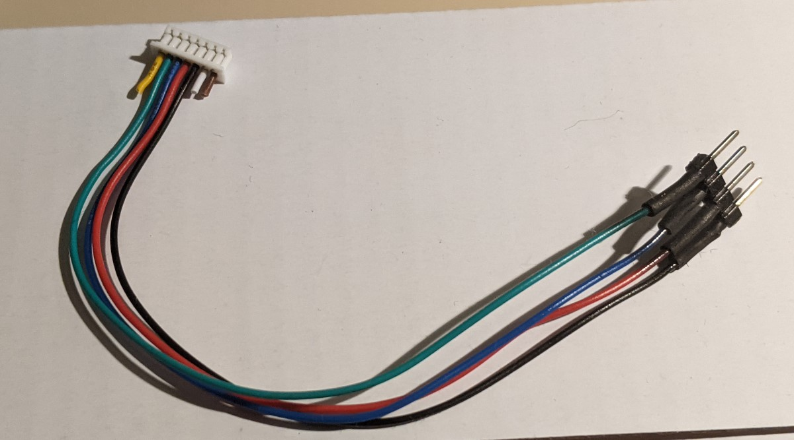

# Hardware

## Bestellijst 
De hardware is ontworpen rondom een ESP8266 platform. De kosten voor alle componentne zijn ongeveer 45-50 euro per apparaat. Hieronder links naar de verschillende componenten (hoeft niet perse daar gekocht te worden). 

- [Wemos D1 Mini - ESP8266-12F](https://www.tinytronics.nl/shop/en/communication/wi-fi/d1-mini-esp8266-12f-ch340) Zorg ervoor dat je de versie koopt met de "deksel" deze is FCC gekeurd en geeft minder storing op de bewegingsensor.
- [Winsen MH-Z19B CO2 Sensor](https://www.tinytronics.nl/shop/nl/sensoren/temperatuur-lucht-vochtigheid/winsen-mh-z19b-co2-sensor-met-kabel): zorg ervoor dat je de __B versie__ koopt. Dit is een NDIR-type CO2 sensor, die na calibratie een goede sensitiviteit heeft. De nauwkeurigheid is echter niet vergelijkbaaar met een industriele sensor (4 a 5 keer zo duur). De echte CO2 waarde kan ongeveer 50 ppm hoger of lager zijn, maar de trend en de grove waardes zijn voor dit doeleinde meer dan genoeg.
- [BME280 I2C Temperature/Humidity Sensor](https://www.tinytronics.nl/shop/nl/sensoren/temperatuur-lucht-vochtigheid/bme280-digitale-barometer-druk-en-vochtigheid-sensor-module): zorg ervoor dat je een versie aanschaft die geconfigureerd is voor I2C, of zorg ervoor dat je het om kunt zetten van SPI naar I2C. BMP280 is ook prima. [Tests](http://www.kandrsmith.org/RJS/Misc/Hygrometers/calib_many.html) hebben laten zien dat de metingen accuraat en stabiel zijn. Afhankelijk hoe de sensor geconfigureerd wordt, zal de temperatuur een beetje onder of boven de echte waar zijn.
- [RCWL-0516 movement sensor](https://www.tinytronics.nl/shop/en/communication/rf/microwave-movement-sensor-rcwl-0516) een kleine sensor die beweging tot 7 m kan detecteren. In dit project wordt deze vooral gebruikt om te detecteren of er mensen aanwezig zijn en of het dus nodig is om iets op het display van de kiwi air monitor te laten zien (of dat het scherm uit kan).
- [SSD1306 128x32 OLED screen I2C](https://www.tinytronics.nl/shop/nl/display/oled/0.91-inch-oled-display-128*32-pixels-wit-i2c): zorg ervoor dat het een I2C versie is en een SSD1306 chipset heeft. Merk maakt niet veel uit. 
- [WS2812B RGB Led](https://www.tinytronics.nl/shop/nl/verlichting/led-digitaal/ws2812b-digitale-5050-rgb-led-printplaat-los-wit): Per apparaat is maar een ledje nodig, maar je kunt ook een hele strip kopen en er andere leuke dingen mee doen. 

Onderdelen die ook nodig zijn, maar waarvan we aannemen dat je die al hebt:
- USB oplader (500ma zou genoeg moeten zijn) of alternatief een powerbank, per dag ongeveer 800mAh rekenen.
- Micro-USB kabel
- Kabeltjes om de sensors vast te maken aan de hoofdunit (ESP8266)
- Soldeerbout
- Voor exprimenteren: Breadboard en kabeltjes om te experimenteren
  
## Stroomverbruik

De Kiwi verbruikt per uur ongeveer 30mAh. Meeste simple USB voedingen voldoen (500mA is ruim voldoende). Daarnaast zijn we een uitbreiding aan het ontwikkelen voor powerbanks erbij op te hangen. Op een powerbank van 2500mAh kun je makkelijk 3 dagen mee draaien. En powerbanks van 6000mAh of meer kun je een week mee vooruit.

## Montage instructies

### Schema

Hieronder een samenvatting van de verbindingen:
| Component | Component side | Wemos D1 Mini |
| --- | --- | --- |
| MH-Z19B | VCC | 5V |
| | GND | G (GND) |
| | TX (Groene ader) | D5 |
| | RX (Blauw ader) | D8 |
| BME280 & SSD1306 | VCC | 3.3V |
| | GND | G |
| | SCL/SCK | D1 |
| | SDA | D2 |
|WS2812B | VDD | 5V |
| | VSS | G |
| | DIN | D4|
| RCWL-0516 | VCC/VIN | 5V |
| | VOUT | D0 |
| | GND | G |
|SDS011 (opt) | VCC | 5V |
| | GND | G |
| | TX | D3 |
| | RX | D6 |
|DS18B20 (opt) | GND (left) | G |
| | DQ (middle) | D7 |
| | VDD (right) | 5V |

Hieronder ook het schema voor experimenten met breadboard view.

## Kabels

### Pluggable-draadjes versie

#### Sensors

**MH-Z19B**: knip de connector die bij de CO2 sensor zit af aan één kant. Knip de bruine, witte en gele aders weg. Er blijven 4 over: zwart, rood, blauw, en groen. Verbind deze 4 kabels in dezelfde volgorde aan 4 pinheaders.

TODO: schrijf over kabel boom en plugjes systeem.

## Behuizing

Om de electronica te beschermen en netjes weg te werken, is het goed om er een behuizing om heen te maken. Er is een ontwerp gemaakt in de vorm van een kiwi vogel dat met een 3D-printer afgedrukt kan worden. In dit model passen precies alle componenten die hierboven beschreven zijn. Als je geen 3D printer tot je beschikking hebt of liever zelf iets anders maakt. Zie hieronder dan ook een aantal tips waar je aan moet denken bij het ontwerp.

### 3D-printen van behuizing

TODO: link naar 3D model + extra uitleg? eventueel een foto?

### Adviezen voor eigen ontwerp

- Zorg ervoor dat componenent niet te dicht bij elkaar zitten
- De CO2 sensor wil graag frisse lucht, hoe er rekening mee dat er genoeg frisse lucht langs kan stromen. Zowel voor afkoeling als voor accurate meting.
- Temperatuur en lucht vochtigheids sensor willen ook frisse lucht, en hebben de voorkeur om niet te warm te worden van componenten om hen heen.
- de bewegings sensor kan storing krijgen van de ESP8266 chip, dus probeer ze niet te dicht bij elkaar te zetten.
- de bewegings sensor werkt door plastic heen, maar wil wel in 1 cm rond het object liever geen metaal. (dus ook draadjes liever niet teveel)